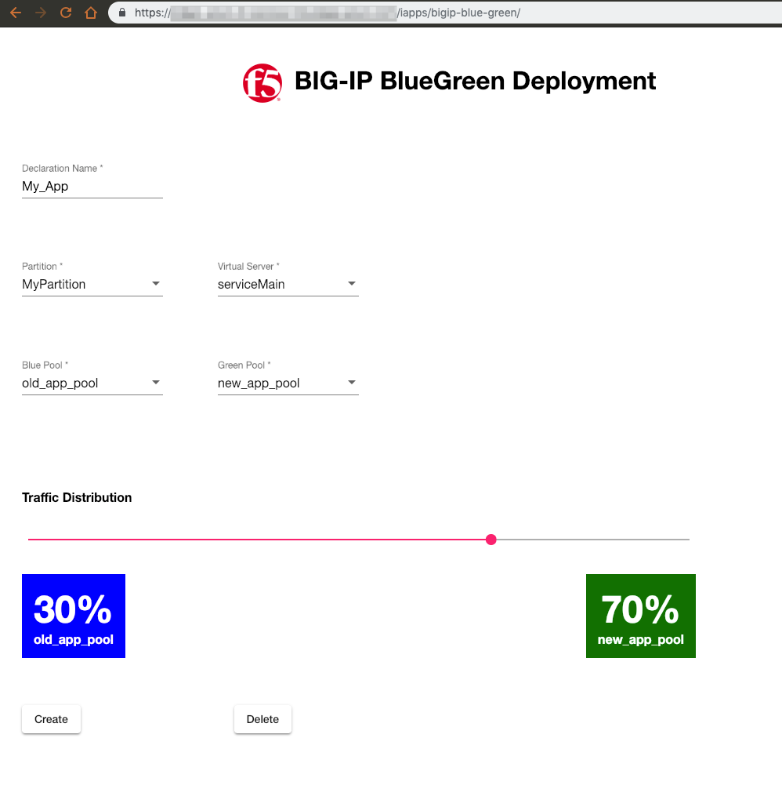
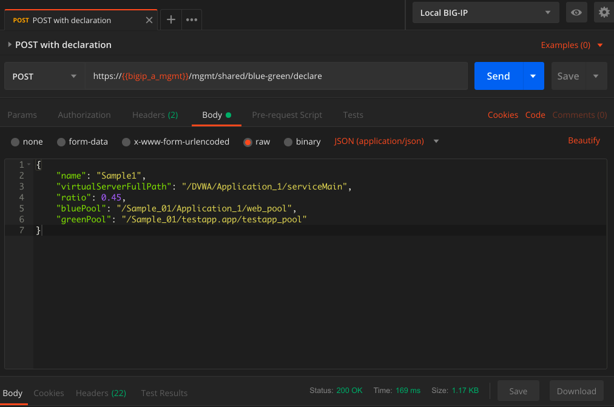

# BigIP BlueGreen
An iControl LX application (with API) to distribute traffic between application server pools

### Screenshots



## RPM Build Steps
```

docker build -t bigip-blue-green-build .
cd ui
npm run build-prod
docker run -v $(pwd):/home/ -it --name bg_build --rm bigip-blue-green-build
docker exec -it bg_build /bin/bash
cd /home
 ./build/buildRpm.sh

 ```


 ### Credits
 Icon based on a rotated version of https://commons.wikimedia.org/wiki/File:Blue_green_cyan_nevit_116.svg