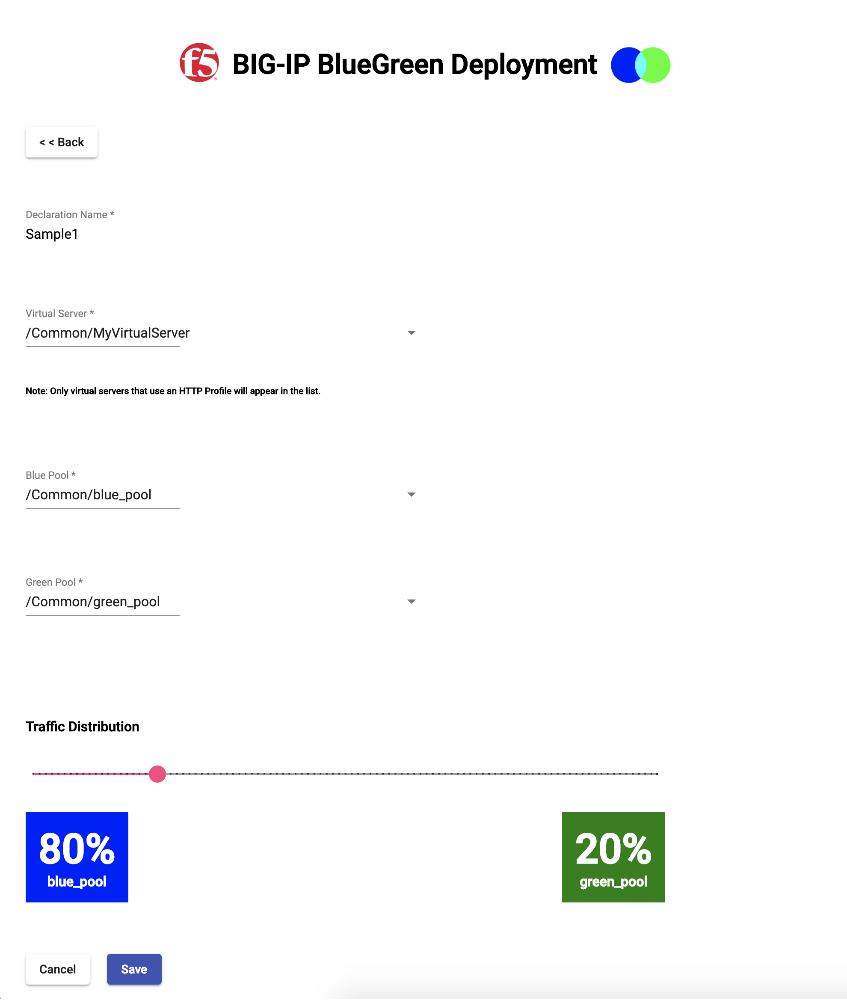

# BIG-IP BlueGreen
An iControl LX application (with API) to distribute traffic between application server pools. The API is implemented in Javascript/NodeJS and runs on a BIG-IP as an [iControl LX](https://clouddocs.f5.com/products/iapp/iapp-lx/tmos-14_0/) application. The web interface is written in [TypeScript](https://www.typescriptlang.org/) and [Angular](https://angular.io/) with [Material](https://material.angular.io/components/select/overview). A simple load test implemented in [Locust](https://locust.io/) (for now).


There are 2 ways to configure BIG-IP BlueGreen: 
* Using the user interface
* Using the declarative API

## Compatibility 
Though not exhaustively tested on all versions, this solution has been reported to work on BIG-IP versions 13.0 - 14.1.

## Installation by BIG-IP UI

1. Download the latest RPM package from the [dist](dist/) directory.

2. To view installed iControl LX Extensions in the BIG-IP GUI you must first enable this functionality. To do this, log in via SSH into the system with an `admin` account and execute `touch /var/config/rest/iapps/enable`. No reboot is required. This will enable the **iApps ‣ Package Management LX** menu:


2. Upload and install the RPM package on the using the BIG-IP GUI:

    * **Main tab > iApps > Package Management LX > Import**
    * Select the downloaded file and click **Upload**


3. Be sure to see the [known issues list](https://github.com/aknot242/bigip-blue-green/issues) to review any known issues and other important information before you attempt to use BIG-IP BlueGreen.

## Usage

### Limitations
* Since the solution uses a form of cookie persistence, the configured Virtual Server must utilize an HTTP Profile. If an HTTP Profile is not set, the Virtual Server will not appear in the user interface, and any declarations using this Virtual Server will not be accepted if using the API.
* Virtual servers can only utilize pools in their own partition, or in the **Common** partition

### UI
1. Log into your BIG-IP
2. Navigate to https://bigip-hostname/iapps/bigip-blue-green


### API
* Included is a [Postman collection](BigIpBlueGreen.postman_collection.json) for references to post declarations to BIG-IP BlueGreen. You can download Postman [here](https://www.getpostman.com/downloads/).

## Screenshots
### User Interface




### Using the API to POST a declaration using Postman


## Package Build
```
build/build.sh
```

 ## Credits
 - Core load balancing logic based on hoolio's [ratio load balancing using rand function](https://devcentral.f5.com/codeshare/ratio-load-balancing-using-rand-function) implementation
 - Icon based on a rotated version of https://commons.wikimedia.org/wiki/File:Blue_green_cyan_nevit_116.svg
