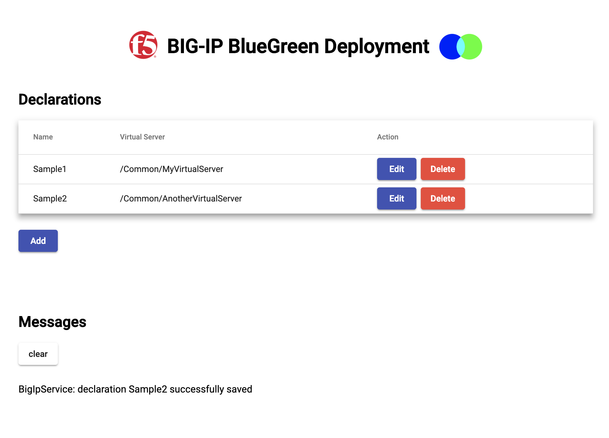

# BIG-IP BlueGreen
An iControl LX application (with API) to distribute traffic between application server pools. The API is implemented in Javascript/NodeJS and runs on a BIG-IP as an [iControl LX](https://clouddocs.f5.com/products/iapp/iapp-lx/tmos-14_0/) application. The web interface is written in [TypeScript](https://www.typescriptlang.org/) and [Angular](https://angular.io/) with [Material](https://material.angular.io/components/select/overview). Load tests implemented in [Locust](https://locust.io/) (for now).

There are 2 ways to configure BIG-IP BlueGreen: 
* Using the user interface
* Using the declarative API

## Installation

1. Download the latest RPM package from the [dist](dist/) directory.

2. Upload and install the RPM package on the using the BIG-IP GUI:

    * **Main tab > iApps > Package Management LX > Import**
    * Select the downloaded file and click **Upload**
    * For complete instructions see [Installing BIG-IP BlueGreen using the BIG-IP Configuration utility](INSTALL-UI.MD) or [Installing BIG-IP BlueGreen using cURL from the Linux shell](INSTALL-SHELL.MD).
3. Be sure to see the [known issues list](https://github.com/aknot242/bigip-blue-green/issues) to review any known issues and other important information before you attempt to use BIG-IP BlueGreen.
4. Provide authorization (basic auth) to the BIG-IP system:
    * If using a RESTful API client like Postman, in the Authorization tab, type the user name and password for a BIG-IP user account with Administrator permissions.
    * If using cURL, see Installing AS3 using cURL from the Linux shell.

## Usage
### UI
1. Log into your BIG-IP
2. Navigate to https://bigip-hostname/iapps/bigip-blue-green


### API
* Included is a [Postman collection](BigIpBlueGreen.postman_collection.json) for references to post declarations to BIG-IP BlueGreen. You can download Postman [here](https://www.getpostman.com/downloads/).

## Screenshots
### User Interface



### Using the API to POST a declaration using Postman


## Package Build
```
build/build.sh
```

 ## Credits
 - Core load balancing logic based on hoolio's [ratio load balancing using rand function](https://devcentral.f5.com/codeshare/ratio-load-balancing-using-rand-function) implementation
 - Icon based on a rotated version of https://commons.wikimedia.org/wiki/File:Blue_green_cyan_nevit_116.svg
