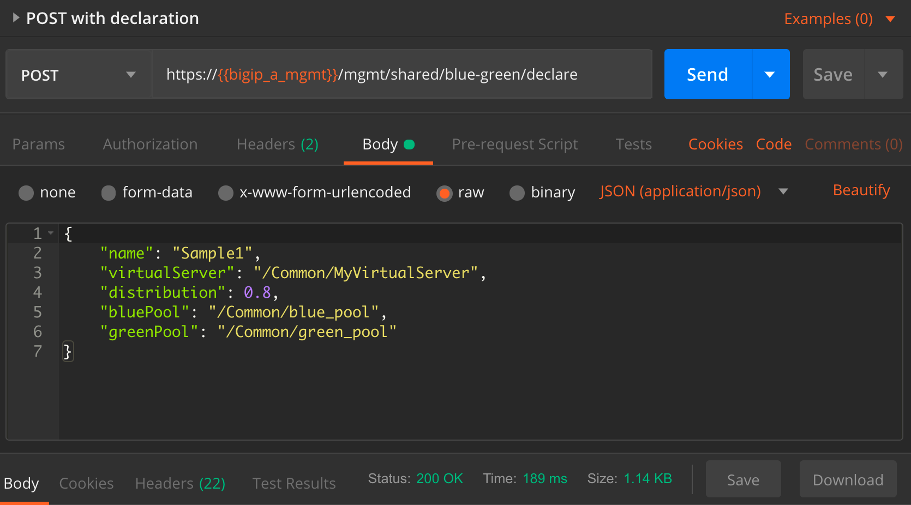

# BigIP BlueGreen
An iControl LX application (with API) to distribute traffic between application server pools. The API is implemented in Javascript/NodeJS and runs on a BIG-IP as an [iControl LX](https://clouddocs.f5.com/products/iapp/iapp-lx/tmos-14_0/) application. The web interface is written in [TypeScript](https://www.typescriptlang.org/) and [Angular](https://angular.io/) with [Material](https://material.angular.io/components/select/overview). Load tests implemented in [Locust](https://locust.io/) (for now).

There are 2 ways to configure: with a user interface, or using its declarative API.

### User Interface


### Using the API to POST a declaration using Postman


## Package Build
```
build/build.sh

```


 ### Credits
 - Core load balancing logic based on hoolio's [ratio load balancing using rand function](https://devcentral.f5.com/codeshare/ratio-load-balancing-using-rand-function) implementation
 - Icon based on a rotated version of https://commons.wikimedia.org/wiki/File:Blue_green_cyan_nevit_116.svg
